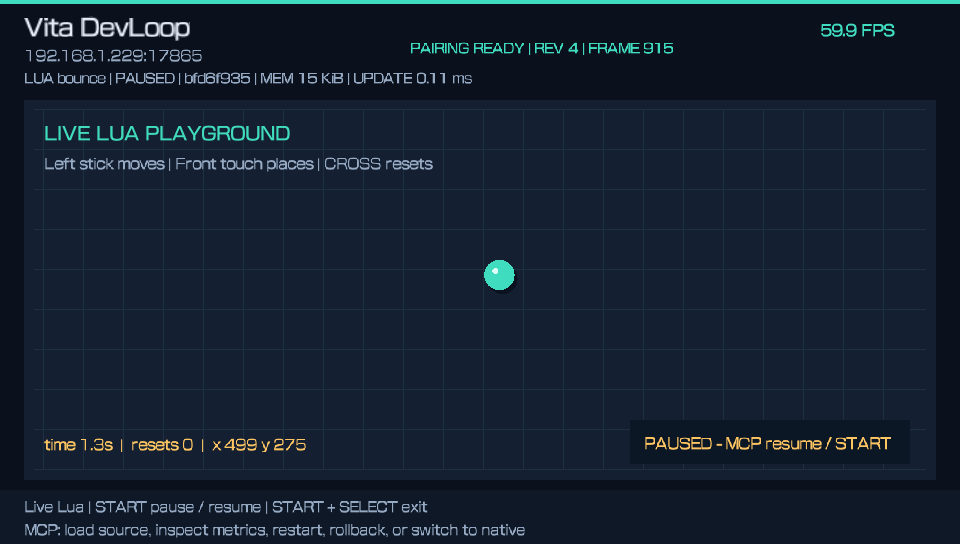
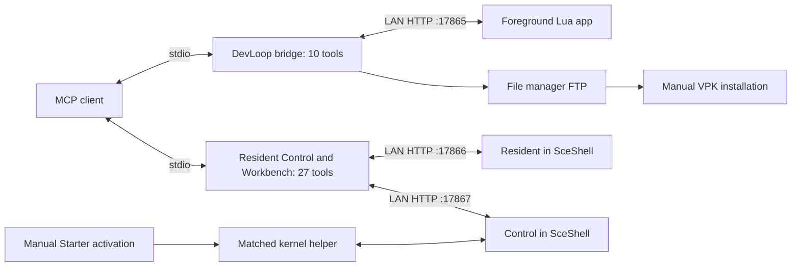

# PS Vita MCP

**Develop and inspect PlayStation Vita homebrew through MCP on real hardware.**

PS Vita MCP connects a desktop MCP client to a modded Vita. The functional staging point combines live Lua editing with background status, verified file transfer, screen readback and bounded input. It is the foundation for the next autonomous development loop.

**Start here: [modded Vita → functional MCP](docs/GETTING-STARTED.md).** The guide covers prerequisites, building, pairing, manual installation, runtime activation, MCP registration, acceptance and recovery after reboot.



*Original DevLoop 01.02 framebuffer capture. [Gallery and provenance](docs/SCREENSHOTS.md).*

**Pairing candidate:** [six-digit Companion pairing](docs/PAIRING.md) adds individual inspection credentials, physical approval and durable 90-day inactivity expiry. Resident 0.1.2 / Control 0.3.4 / Starter 01.05 are isolated candidates; they have not been installed or qualified on the Vita. [Candidate checks and remaining gates](docs/pairing-candidate-validation.json).

## Where we are

The October 3 baseline is retained in [the historical record](docs/BASELINE.md). [October 4 qualification](docs/QUALIFICATION.md) records the newer development Control 0.3.3 tests and the remaining physical gates. Public packages have separate fingerprints and still need fresh acceptance. This is a developer preview candidate; no final binary release is certified.

| Component | Role | Source / recorded runtime |
| --- | --- | --- |
| Vita DevLoop | Foreground Lua edit/run/observe/recover; ten MCP tools | Public 01.03 candidate; hardware record uses 01.02. Changed 01.03 needs physical acceptance. |
| [Vita Resident](docs/RESIDENT.md) | Boot-loaded status and verified DevLoop package inbox; four tools | 0.1.2 pairing candidate; installed hardware record remains 0.1.1 |
| [Vita Control](docs/CONTROL.md) | Background screen, managed files, app commands and bounded synthetic input; thirteen tools | 0.3.4 pairing candidate, ABI 2; installed record remains 0.3.3; physical gates open |
| [Vita Workbench](workbench/README.md) | Hash-pinned Lua trials, metrics, capture soak, candidate staging and file recovery; ten tools | Developer preview; public-package acceptance pending |
| Control Starter | Explicit activation after normal boot, then exits | 01.04, title `CHRS00011` |
| [Control Inspector](docs/INSPECTOR.md) | Optional read-only app/Shell diagnostic | 01.03; not required for the baseline |

Resident and Control share one **27-tool desktop MCP server**. DevLoop has its own ten-tool server. The computer speaks MCP over stdio; the Vita runs authenticated HTTP services. Control remains available after Starter exits, until normal reboot. DevLoop must be open for Lua operations.

Recorded checks include managed file publish/readback/copy/hash-guarded deletion, file manager/LiveArea/DevLoop screen readback, DevLoop launch/quit, five input channels observed by app telemetry, input expiry without a PC release, stale-target refusal and focus cancellation. Public build results remain separate from those original device identities. No prebuilt public binary release is available yet.

## Build and set up

Use Windows, PowerShell 7, Python 3.13, Git and Docker Desktop with Linux containers:

```powershell
git clone https://github.com/LeiterConsulting/ps-vita-mcp.git
cd ps-vita-mcp
.\Setup-DevLoop.ps1
.\Build-McpBaseline.ps1
```

The build runs host C, actual MCP stdio and local FTP fixtures, then validates the ARM modules and VPKs. It never contacts the Vita. Outputs are under `dist/devloop/`, `dist/resident/`, `dist/control/` and `dist/workbench/`; reports bind exact sources and artifact hashes.

Follow [the complete setup guide](docs/GETTING-STARTED.md) to install and pair the components. Native installation and activation are manual. Full Control loads through Starter after a normal boot; the earlier boot-loaded Control configuration hung and is excluded from this path.

After DevLoop pairing, an example edit can run without rebuilding the native app:

```powershell
.\.venv-devloop\Scripts\python.exe bridge\run_script.py experiments\bounce.lua --resume --capture
```

Workbench can run hash-pinned smoke/input profiles, check metrics and expiry, retain captures, and restore the original scene paused. Start with `vita_workbench_doctor`; [Workbench workflows](workbench/README.md) and the [release checklist](docs/RELEASE-CHECKLIST.md) describe the limits.

The [Lua interface](SCRIPTING.md) covers drawing, input observations, metrics and recovery. The [input proof](experiments/mcp_input_proof.lua) observes synthetic Control delivery and neutral return after lease expiry.

## How it fits together



[Architecture](docs/ARCHITECTURE.md) explains revision guards, capture and lifecycle. [Control tools](docs/CONTROL.md) document arguments, limits, the loopback preview and paired-module identity. [DevLoop tools](docs/TOOLS.md) describe its separate foreground interface.

## Current limits

- Control captures on-demand still images: preview up to 240×136, detail up to 480×272. Warm samples were about 126–324 ms; multi-second outliers occurred. Sustained video and latency guarantees remain open.
- Input leases last 16–1000 ms and cancel on focus change. One synthetic contact per panel is supported. Stick offsets add to physical centers; readback and calibration matter. PS/power/volume are excluded.
- Control files are confined to fresh revisions under `ux0:data/vita-control/workspace`; transfers are at most 8 MiB. System and installed-app writes are outside this API.
- DevLoop Lua source is at most 16 KiB, with a 1 MiB allocation budget per VM and callback instruction budgets. Drawing is limited to 256 buffered commands. Script state is in RAM; assets/audio/file APIs are future work.
- Native installation, startup confirmation and reboot recovery require an operator. Physical touch restoration, sleep/wake, independent Wi-Fi-loss recovery and additional device combinations need qualification. Pairing uses unencrypted HTTP on a trusted LAN.

These are current implementation limits. A heartbeat or accepted API call alone does not establish a working autonomous session. [New-device acceptance](docs/BASELINE.md#acceptance-on-a-new-device) is the gate for remaining DevLoop work.

## Documentation and support

| Need | Reference |
| --- | --- |
| Full setup from an already modded Vita | [Getting started](docs/GETTING-STARTED.md) |
| Staging identity and acceptance | [Functional baseline](docs/BASELINE.md), [machine-readable record](docs/functional-mcp-baseline.json) |
| Recovery, failed startup, stale markers, endpoint errors | [Troubleshooting](docs/TROUBLESHOOTING.md) |
| Test scope and release checks | [Validation](docs/VALIDATION.md), [current qualification](docs/QUALIFICATION.md), [release checklist](docs/RELEASE-CHECKLIST.md) |
| Follow-on development | [Roadmap](ROADMAP.md) |
| Reproduction or contribution | [Contributing](CONTRIBUTING.md), [issue form](https://github.com/LeiterConsulting/ps-vita-mcp/issues/new/choose) |

Original project code and documentation use [MIT](LICENSE), selected for easy reuse. Dependencies keep their existing licenses; [third-party notices](THIRD_PARTY_NOTICES.md) include the adapted input-hook license. Complete linked-library notices are a prerequisite to public binary distribution. This is an independent homebrew project.

## References

- [Model Context Protocol](https://modelcontextprotocol.io/)
- [VitaSDK](https://vitasdk.org/)
- [libvita2d](https://github.com/xerpi/libvita2d)
- [Lua](https://www.lua.org/)
