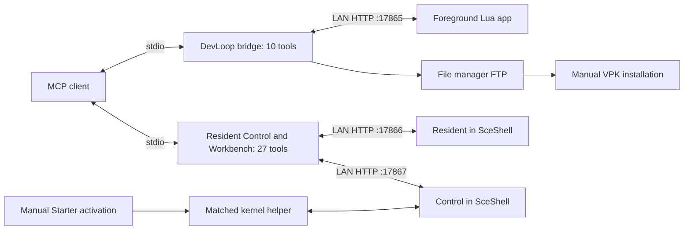

# PS Vita MCP

**Develop and inspect PlayStation Vita homebrew through MCP on real hardware.**

PS Vita MCP connects a desktop MCP client to a modded Vita. Its PC bridges combine live Lua editing with background status, verified file transfer, screen readback and bounded input. The repository contains the PC and Vita source, build scripts, examples and tests needed to reproduce this developer preview.

**Start here: [modded Vita → functional MCP](docs/GETTING-STARTED.md).** The guide covers prerequisites, building, pairing, manual installation, runtime activation, MCP registration, acceptance and recovery after reboot.


*Original DevLoop 01.02 framebuffer capture. [Gallery and provenance](docs/SCREENSHOTS.md).*

**Pairing candidate:** [six-digit Companion pairing](docs/PAIRING.md) adds individual inspection credentials, physical approval and durable 90-day inactivity expiry. Resident 0.1.2 / Control 0.3.4 / Starter 01.06 are installed on the test Vita. Normal startup, physical code display and graceful challenge timeout passed; individual credential confirmation and the wider device gates remain open. [Candidate checks and remaining gates](docs/PAIRING-DEVICE-TESTS.md).

## Status as of October 5 2026

Development and device testing are paused. This source update publishes the existing PC/Vita work and its documentation. The latest hardware observations were recorded on October 4; the Vita has not been retested for this publication.

The October 3 baseline is retained in [the historical record](docs/BASELINE.md). [October 4 qualification](docs/QUALIFICATION.md) records the earlier Control 0.3.3 tests. [Current pairing gates](docs/PAIRING-DEVICE-TESTS.md) record the installed 0.1.2 / 0.3.4 / 01.06 candidate and its partial results. A fresh build does not inherit another package's acceptance. This is a source developer preview; no final binary release is certified.

| Component | Role | Source / recorded runtime |
| --- | --- | --- |
| Vita DevLoop | Foreground Lua edit/run/observe/recover; ten MCP tools | Public 01.03 candidate; hardware record uses 01.02. Changed 01.03 needs physical acceptance. |
| [Vita Resident](docs/RESIDENT.md) | Boot-loaded status and verified DevLoop package inbox; four tools | 0.1.2 pairing candidate installed; startup passed, pairing qualification open |
| [Vita Control](docs/CONTROL.md) | Background screen, managed files, app commands and bounded synthetic input; thirteen tools | 0.3.4 pairing candidate installed, ABI 2; startup passed, physical regressions open |
| [Vita Workbench](workbench/README.md) | Hash-pinned Lua trials, metrics, capture soak, candidate staging and file recovery; ten tools | Developer preview; public-package acceptance pending |
| Control Starter | Explicit activation after normal boot, then exits | 01.06 pairing candidate installed, title `CHRS00011`; 01.04 retained as the older rollback |
| [Control Inspector](docs/INSPECTOR.md) | Optional read-only app/Shell diagnostic | 01.03; not required for the baseline |

Resident and Control share one **27-tool desktop MCP server**. DevLoop has its own ten-tool server. The computer speaks MCP over stdio; the Vita runs authenticated HTTP services. Control remains available after Starter exits, until normal reboot. DevLoop must be open for Lua operations.

Recorded checks include managed file publish/readback/copy/hash-guarded deletion, file manager/LiveArea/DevLoop screen readback, DevLoop launch/quit, five input channels observed by app telemetry, input expiry without a PC release, stale-target refusal and focus cancellation. Public build results remain separate from those original device identities. No prebuilt public binary release is available yet.

The PC upload repair preserves the same attempt ID in the Workbench journal, Resident transfer and readbacks. Local MCP tests cover recovery after a lost reply without repeating the upload. Starter 01.06 also passed physical code display and graceful timeout after the 01.05 display failure. Successful individual confirmation, saved reconnect, phone permissions and persistence still need device acceptance; the PC pairing form was stopped before a fresh request.

## Public PC code and private iPhone app

The **iPhone Companion app remains private**. Its app source, Swift packages, Xcode projects, signing material, builds and handoff archives are excluded from this repository. The project's public source license does not distribute or license that private implementation.

[PC setup and workflows](docs/PC-SIDE.md) cover the public desktop tools. [The iPhone Companion guide](docs/IPHONE-COMPANION.md) documents pairing, inspection permissions and recovery without app source. The public pairing protocol and Vita implementation remain here so desktop clients can interoperate. `.gitignore` and CI enforce the file boundary; credentials and raw device evidence also stay local.

## Build and set up

Use Windows, PowerShell 7, Python 3.13, Git and Docker Desktop with Linux containers:

```powershell
git clone https://github.com/LeiterConsulting/ps-vita-mcp.git
cd ps-vita-mcp
.\Setup-DevLoop.ps1
.\Build-McpBaseline.ps1
```

The build runs host C, actual MCP stdio and local FTP fixtures, then validates the ARM modules and VPKs. It never contacts the Vita. Outputs are under `dist/devloop/`, `dist/resident/`, `dist/control/` and `dist/workbench/`; reports bind exact sources and artifact hashes.

Follow [the complete setup guide](docs/GETTING-STARTED.md) to install and pair the components. Native installation and activation are manual. Full Control loads through Starter after a normal boot; the earlier boot-loaded Control configuration hung and is excluded from this path.

After DevLoop pairing, an example edit can run without rebuilding the native app:

```powershell
.\.venv-devloop\Scripts\python.exe bridge\run_script.py experiments\bounce.lua --resume --capture
```

Workbench can run hash-pinned smoke/input profiles, check metrics and expiry, retain captures, and restore the original scene paused. Start with `vita_workbench_doctor`; [Workbench workflows](workbench/README.md) and the [release checklist](docs/RELEASE-CHECKLIST.md) describe the limits.

The optional [PC pairing check](docs/PC-SIDE.md#test-native-pairing-from-the-pc) opens a loopback form for immediate manual code entry. Its self-tests run without a Vita; live use requires exact installed build pins and an operator at Starter. It does not start automatically with MCP.

The [Lua interface](SCRIPTING.md) covers drawing, input observations, metrics and recovery. The [input proof](experiments/mcp_input_proof.lua) observes synthetic Control delivery and neutral return after lease expiry.

## How it fits together



[Architecture](docs/ARCHITECTURE.md) explains revision guards, capture and lifecycle. [Control tools](docs/CONTROL.md) document arguments, limits, the loopback preview and paired-module identity. [DevLoop tools](docs/TOOLS.md) describe its separate foreground interface.

## Current limits

- Control captures on-demand still images: preview up to 240×136, detail up to 480×272. Warm samples were about 126–324 ms; multi-second outliers occurred. Sustained video and latency guarantees remain open.
- Input leases last 16–1000 ms and cancel on focus change. One synthetic contact per panel is supported. Stick offsets add to physical centers; readback and calibration matter. PS/power/volume are excluded.
- Control files are confined to fresh revisions under `ux0:data/vita-control/workspace`; transfers are at most 8 MiB. System and installed-app writes are outside this API.
- DevLoop Lua source is at most 16 KiB, with a 1 MiB allocation budget per VM and callback instruction budgets. Drawing is limited to 256 buffered commands. Script state is in RAM; assets/audio/file APIs are future work.
- Native installation, startup confirmation and reboot recovery require an operator. Physical touch restoration, sleep/wake, independent Wi-Fi-loss recovery and additional device combinations need qualification. Pairing uses unencrypted HTTP on a trusted LAN.

These are current implementation limits. A heartbeat or accepted API call alone does not establish a working autonomous session. [New-device acceptance](docs/BASELINE.md#acceptance-on-a-new-device) is the gate for remaining DevLoop work.

## Documentation and support

| Need | Reference |
| --- | --- |
| Full setup from an already modded Vita | [Getting started](docs/GETTING-STARTED.md) |
| PC bridges, configuration, testing and recovery | [PC side](docs/PC-SIDE.md) |
| Private iPhone app workflow and public pairing contract | [iPhone Companion](docs/IPHONE-COMPANION.md), [pairing protocol](docs/PAIRING.md) |
| Staging identity and acceptance | [Functional baseline](docs/BASELINE.md), [machine-readable record](docs/functional-mcp-baseline.json) |
| Recovery, failed startup, stale markers, endpoint errors | [Troubleshooting](docs/TROUBLESHOOTING.md) |
| Test scope and release checks | [Validation](docs/VALIDATION.md), [current qualification](docs/QUALIFICATION.md), [release checklist](docs/RELEASE-CHECKLIST.md) |
| Follow-on development | [Roadmap](ROADMAP.md) |
| Reproduction or contribution | [Contributing](CONTRIBUTING.md), [issue form](https://github.com/LeiterConsulting/ps-vita-mcp/issues/new/choose) |

Original project code and documentation use [MIT](LICENSE), selected for easy reuse. Dependencies keep their existing licenses; [third-party notices](THIRD_PARTY_NOTICES.md) include the adapted input-hook license. Complete linked-library notices are a prerequisite to public binary distribution. This is an independent homebrew project.

## References

- [Model Context Protocol](https://modelcontextprotocol.io/)
- [VitaSDK](https://vitasdk.org/)
- [libvita2d](https://github.com/xerpi/libvita2d)
- [Lua](https://www.lua.org/)
