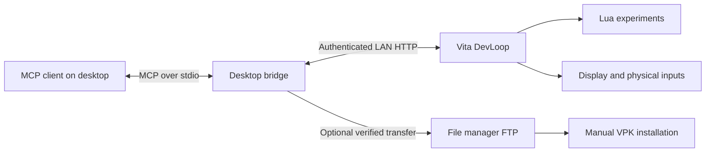
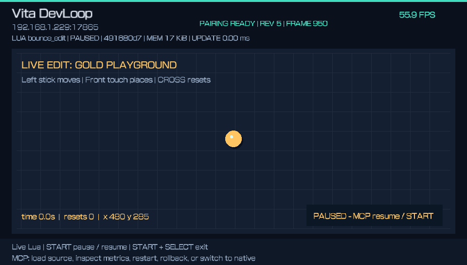
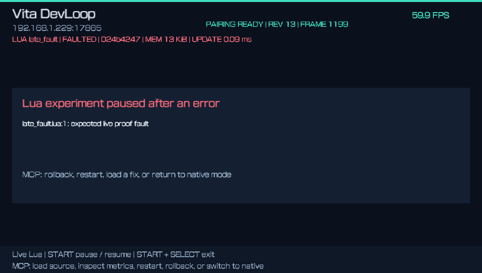

# PS Vita MCP

**Build, inspect and iterate on PlayStation Vita homebrew through MCP.**

PS Vita MCP connects an MCP client on your computer to a development app running on a homebrew-enabled Vita. Its first implementation, **Vita DevLoop**, lets you send Lua experiments over Wi-Fi, inspect inputs and runtime metrics, capture the screen, and recover from a failed edit.

The aim is a useful development loop on real hardware: **edit → run → observe → recover**.


*Original framebuffer capture from the tested 01.02 prototype, paused after a short run. [Screenshots and their provenance](docs/SCREENSHOTS.md).*

## Project status

The repository includes three independently scoped components:

| Component | Public source | Hardware evidence |
| --- | --- | --- |
| Vita DevLoop | 01.03 development candidate | 01.02 live Lua/edit/capture/recovery passed; changed 01.03 still needs installation, live-loop, exit and sleep/return checks |
| [Vita Resident](docs/RESIDENT.md) | 0.1.1 background status/upload service and four-tool bridge | Status and verified probe/package storage passed with the file manager in the foreground; gameplay coexistence and sleep/wake remain open |
| [Control Inspector](docs/INSPECTOR.md) | 01.03 read-only app/Shell diagnostic | Both metadata checks, both proxy unloads and normal app exit passed; the kernel helper stays loaded until reboot |

DevLoop 01.03 adds a graphics shutdown fix to the physically tested 01.02 prototype. Each component keeps its own build and runtime qualification. No prebuilt public release is available yet.

The prototype was tested on a homebrew-enabled Vita running firmware 3.65, with a Windows desktop bridge. Other device, firmware and host combinations need their own verification. See [validation and release criteria](docs/VALIDATION.md).

## What DevLoop already does

| Capability | What it enables |
| --- | --- |
| Live Lua reload | Change an experiment without rebuilding or reinstalling the native app for each edit |
| Hardware inspection | Read buttons, sticks, front/rear touch and motion samples with API status |
| Screen capture | Retrieve a 960×544 PNG of DevLoop's own display with frame and revision metadata |
| Runtime inspection | Read logs, script errors, Lua allocation, callback timing samples and custom metrics |
| Experiment recovery | Pause, restart, retain one previous Lua VM for rollback, or return to the native experiment |
| Verified package staging | Transfer the selected DevLoop VPK through the file manager's FTP server and verify two SHA-256 read-backs before manual installation |

The DevLoop bridge exposes [ten MCP tools](docs/TOOLS.md). Its live capabilities belong to the foreground DevLoop app. The separate [Resident bridge](docs/RESIDENT.md) adds background status and verified DevLoop inbox uploads. Native installation remains manual.

## Build and try it

The documented build uses Windows, PowerShell 7, Python 3.13 and Docker Desktop:

```powershell
git clone https://github.com/LeiterConsulting/ps-vita-mcp.git
cd ps-vita-mcp
.\Setup-DevLoop.ps1
.\Build-DevLoop.ps1
```

This runs host, MCP and FTP fixture tests, builds the ARM app, and writes the verified VPK and hash report to `dist/devloop/`. Follow [setup and pairing](docs/SETUP.md) to install the experimental candidate manually, configure the bridge and connect an MCP client. No prebuilt GitHub release is available yet.

After pairing and opening DevLoop:

```powershell
.\.venv-devloop\Scripts\python.exe bridge\run_script.py experiments\bounce.lua --resume --capture
```

Edit the example and send it again, or use the explicit foreground `--watch` option. The [Lua interface](SCRIPTING.md) covers drawing, physical input, metrics and recovery.

## How it fits together



The MCP server runs on the computer. The Vita runs a native development host with a small HTTP interface. The app must be open for live inspection and script changes. [Architecture and boundaries](docs/ARCHITECTURE.md).

## Starter experiments

| Example | What to try |
| --- | --- |
| [Bounce playground](experiments/bounce.lua) | Change the scene's colours, move the ball with the left stick, or place it with front touch |
| [Input scope](experiments/input_scope.lua) | Inspect buttons, both sticks, both touch panels and motion read status |



*A source edit changes the title and ball colour without reinstalling the app. This capture is paused after candidate preflight.*



*An intentional Lua callback error pauses the experiment and exposes recovery instructions. Both captures are from 01.02. [Full gallery](docs/SCREENSHOTS.md).*

Persistent projects, sprites/audio and integration into other native apps follow on the [roadmap](ROADMAP.md).

## Background service and diagnostics

Build Resident with `Build-Resident.ps1`, and Inspector with `Build-Inspector.ps1`, after the same checkout setup. Resident has a guarded configuration proposal and manual boot activation. Inspector is an installable diagnostic app whose temporary read-only helpers require a normal reboot between sessions. Follow their dedicated guides for recovery and qualification.

System-wide input, cross-app screen interaction and a fully autonomous native development loop are being explored. A read-only Inspector pass does not qualify those broader operations.

## Current prototype limits

- Lua source is limited to 16 KiB, with a 1 MiB allocation budget per VM and instruction budgets for callbacks.
- Rendering exposes up to 256 buffered primitive/text commands per draw. Script asset, audio and file APIs are not exposed yet.
- Scripts and rollback state live in RAM; closing the app loses that device-side state.
- Callback timings are CPU samples, not GPU timings or a frame-latency guarantee.
- Pairing authenticates requests, but the prototype uses unencrypted HTTP on a trusted local network.

These are current host limits, not claims about the Vita's maximum capabilities.

## Contributing

Useful contributions include reproductions on additional hardware, small original examples, setup improvements and narrowly scoped capability additions. Please read [CONTRIBUTING.md](CONTRIBUTING.md) before proposing a change.

Original project code and documentation are licensed under [MIT](LICENSE). Dependencies retain their own licenses; see [third-party notices](THIRD_PARTY_NOTICES.md). This is an independent homebrew project.

## References

- [Model Context Protocol](https://modelcontextprotocol.io/)
- [VitaSDK](https://vitasdk.org/)
- [libvita2d](https://github.com/xerpi/libvita2d)
- [Lua](https://www.lua.org/)
