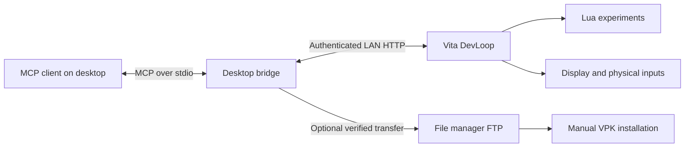

# PS Vita MCP

**Build, inspect and iterate on PlayStation Vita homebrew through MCP.**

PS Vita MCP connects an MCP client on your computer to a development app running on a homebrew-enabled Vita. Its first implementation, **Vita DevLoop**, lets you send Lua experiments over Wi-Fi, inspect inputs and runtime metrics, capture the screen, and recover from a failed edit.

The aim is a useful development loop on real hardware: **edit → run → observe → recover**.

## Project status

This repository currently contains the public project foundation. The DevLoop prototype has been built and exercised on a physical Vita; its source import, public setup guide and first installable preview are the next milestones. **There is no public VPK or runnable server in this repository yet.**

The prototype was tested on a homebrew-enabled Vita running firmware 3.65, with a Windows desktop bridge. Other device, firmware and host combinations need their own verification. See [validation and release criteria](docs/VALIDATION.md).

## What DevLoop already does

| Capability | What it enables |
| --- | --- |
| Live Lua reload | Change an experiment without rebuilding or reinstalling the native app for each edit |
| Hardware inspection | Read buttons, sticks, front/rear touch and motion samples with API status |
| Screen capture | Retrieve a 960×544 PNG of DevLoop's own display with frame and revision metadata |
| Runtime inspection | Read logs, script errors, Lua allocation, callback timing samples and custom metrics |
| Experiment recovery | Pause, restart, retain one previous Lua VM for rollback, or return to the native experiment |
| Verified package staging | Transfer the selected DevLoop VPK through the file manager's FTP server and verify two SHA-256 read-backs before manual installation |

The current bridge exposes [ten MCP tools](docs/TOOLS.md). These capabilities belong to the running DevLoop app. System-wide capture, arbitrary game control and automatic installation are future possibilities requiring separate designs and tests.

## How it fits together

The MCP server runs on the computer. The Vita runs a native development host with a small HTTP interface. The app must be open for live inspection and script changes. [Architecture and boundaries](docs/ARCHITECTURE.md).

## First public preview

The first preview will focus on one complete experience:

1. Build or install the DevLoop app and pair it with the desktop bridge.
2. Open a small example and send it to the Vita.
3. Make a visible change, inspect its metrics and capture the result.
4. Try a failed edit and recover to the previous working experiment.

An input inspector and a small animated scene will be the starter examples. Persistent projects, sprites/audio and integration into other native apps follow on the [roadmap](ROADMAP.md).

## Current prototype limits

- Lua source is limited to 16 KiB, with a 1 MiB allocation budget per VM and instruction budgets for callbacks.
- Rendering exposes up to 256 buffered primitive/text commands per draw. Script asset, audio and file APIs are not exposed yet.
- Scripts and rollback state live in RAM; closing the app loses that device-side state.
- Callback timings are CPU samples, not GPU timings or a frame-latency guarantee.
- Pairing authenticates requests, but the prototype uses unencrypted HTTP on a trusted local network.

These are current host limits, not claims about the Vita's maximum capabilities.

## Contributing

Useful contributions include reproductions on additional hardware, small original examples, setup improvements and narrowly scoped capability additions. Please read [CONTRIBUTING.md](CONTRIBUTING.md) before proposing a change.

Original project code and documentation are licensed under [MIT](LICENSE). Dependencies and any separately supplied content retain their own licenses. This is an independent homebrew project.

## References

- [Model Context Protocol](https://modelcontextprotocol.io/)
- [VitaSDK](https://vitasdk.org/)
- [libvita2d](https://github.com/xerpi/libvita2d)
- [Lua](https://www.lua.org/)
