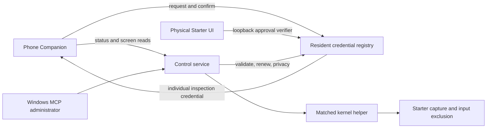

# Vita Companion pairing implementation

This native candidate implements the approved six-digit exchange alongside the existing Windows administrator token. Resident 0.1.2, Control 0.3.4 and Starter 01.06 are installed on the test Vita. Matching service startup, physical code display and graceful challenge timeout passed. Individual credential confirmation and the remaining [device gates](PAIRING-DEVICE-TESTS.md) are still open. These partial results do not qualify the phone allowlist for release.

## Contract decisions recorded before implementation

The public routes and response fields follow the proposed `Vita Companion Pairing`, protocol 1 contract: `GET /pairing/info`, `POST /pairing/request`, `POST /pairing/confirm`, and individual-bearer `GET /pairing/session` on Resident's port. Requests are at most 1024 bytes; JSON responses at most 4096. IDs/nonces/tokens are 32 lowercase hex characters, the displayed code is six digits, and inactivity is exactly 7,776,000 seconds.

The following implementation choices qualify the proposal without changing the phone's public route shapes:

- **Initial phone credentials permit inspection only.** Resident status and Control status, power-status and framebuffer reads use the shared expiry authority. Input, power renewal, files and app commands remain available to the existing Windows token. Phone writes require a separate native ownership qualification; pairing does not give a second host an input/work lease.
- **The challenge deadline starts once at request creation.** Approval displays the remaining part of that 120-second deadline; retries, approval and wrong codes cannot restart it. This resolves the proposal's ambiguity between request expiry and a full two minutes after approval.
- **Starter uses private, loopback-only administrator routes for local UI actions.** They are refused on LAN connections, even with the Windows token. Starter generates the code from the SDK random API and sends a challenge-bound SHA-256 verifier to Resident. No HTTP response returns the code, and it is never persisted. The phone's confirmation request necessarily contains its entered code.
- **Starter is excluded from native capture and synthetic input.** The kernel checks the displayed process title and refuses both operations for `CHRS00011`. Pairing approval therefore uses physical controls, and the screen service cannot return the displayed code. This restriction applies to the Windows token too.
- **An active code also blocks all screen captures.** A loopback privacy receipt from Resident is required before capture. Approved and completed challenges block captures until the original deadline, including lost-confirmation recovery; this covers Shell overlays as well as the Starter process. Screen inspection resumes after at most 120 seconds. Authority loss fails closed for capture, while independent Windows status, files, input and app authentication remain available. The kernel title rule still protects Starter after that deadline. Device testing must check overlays and cached thumbnails; no physical pixel-privacy claim is made yet.
- **Approval needs a fresh physical CROSS edge.** The UI first observes valid neutral controller samples for at least 500 ms. A held button or stale sample cannot approve pairing or the Forget confirmation. This also drains input samples left by a previous foreground application.
- **Resident is the sole registry writer.** Control validates and commits phone authentication through a bounded loopback exchange with Resident. Both services use the same expiry/revocation decision. A failed renewal never yields an extended receipt.
- **Persistence uses two checked generations.** The inactive slot is written, read back, atomically renamed and read back again before acknowledgement. Startup chooses the highest valid generation and refuses any corrupt or unsupported existing slot. Failed persistence disables phone authentication while preserving independent Windows authentication.
- **Clock rollback fails closed.** UTC is checked against durable high-water time, and observed expiration is retained. This detects rollback relative to previously observed/committed time; it cannot certify an unobserved clock change while the device was powered off. Monotonic time bounds requests; RTC errors prevent phone renewal.

Public capability probes never disclose codes, credential digests, registry entries or tokens. Approval/rejection, a short open window, one active request, five wrong attempts, per-device cooldown, nonce/client binding and original-deadline lost-reply recovery are native responsibilities. Pending/recovery records live only in memory and disappear on reboot.

## Local UI and registry

Starter retains its existing one-load guard. A separate Pair a phone action remains available when the guard blocks another module load. Reopening Starter for pairing does not load/unload the kernel or Shell modules, retire the guard or edit boot configuration. The UI shows the requested phone label, physical CROSS/CIRCLE approval, a countdown and the local code; paired-phone listing and Forget phone use the same local authority.

Private UI routes live under `/pairing/ui/`; internal Control validation/renewal routes under `/pairing/native/`. Both require loopback and the existing administrator token. They are not part of the phone API. A short UI heartbeat closes abandoned windows without extending the challenge.

The bounded registry resides under `ux0:data/vita-resident/private/`, outside upload and Control workspace paths. It stores device/client/credential IDs, token digests, safely encoded labels, authoritative last-seen/expiry, revocation and a format/checksum/generation. Tokens are returned only by successful confirmation and retained briefly in memory for exact lost-response recovery. At most eight active phones are allowed. A revoked or expired slot can be reused; its former token remains unrecognized. A same-client re-pair replaces its previous credential. Device writes require file sync, rename, device sync and readback before success. Unexpected `.part` files disable phone authority on startup until inspected; they are retained rather than replayed or discarded.

An expired, rejected or exhausted nonce cannot start another deadline when the local window reopens. The phone must generate a fresh nonce for a new exchange. UTC has whole-second resolution; the monotonic deadline enforces exactly 120 seconds, with a rounded-up RTC backstop. Control reregisters its build with Resident every five seconds so a restarted Resident does not require a kernel reload.

## Operator flow after manual candidate installation

Use the exact build identities in [candidate validation](pairing-candidate-validation.json). Retain the previously qualified packages and configuration. Replace the Resident plugin and install Starter manually during a confirmed normal reboot; never activate a second Control pair within the existing boot. Do not add Control to `config.txt`. Host checks and native installation receipts are separate evidence.

Before native activation, use this checkout's host bridge and its Python environment: `resident/bridge.py` recognizes the new versions while retaining legacy compatibility. Set `VITA_RESIDENT_CONFIG` to the existing private desktop configuration path. Keep that file outside Git; do not move a token into source, an issue or a report. Update the private Workbench build pins to the exact candidate reports only when manually activating those binaries. The old registered desktop bridge and installed Vita are still unchanged by this work.

1. Start the matched Control once with CROSS, then let the desktop verify identity and neutral leases. Pairing is a separate action; reopening Starter does not permit another module load.
2. In Starter, press SQUARE. On the phone, select Pair a Vita. Check the displayed phone label, release the controls briefly, then press CROSS. CIRCLE declines or closes the window.
3. Read the six-digit code on the Vita and enter it on that phone. Leading zeroes matter. A successful confirmation saves an individual credential, never the desktop administrator token.
4. Return from Starter using START+SELECT. Status inspection works immediately; captures wait until the original challenge deadline has passed. Do not run a desktop input/work trial concurrently with the phone session.
5. TRIANGLE shows paired phones, last-seen and expiry dates. Select a phone, press CROSS, release the controls briefly, then press CROSS again to confirm Forget. Forgotten or expired credentials cannot reconnect; pair again with a fresh nonce.

The old legacy import targets the retained 0.1.1 / 0.3.3 rollback. The existing Windows administrator token also works with the installed candidate. Do not promote the 0.1.2 / 0.3.4 phone allowlist based on host tests or partial startup checks alone. Legacy import has administrator authority and no individual expiry; it is separate from this protocol.

## Qualification gates

Host tests must cover approval, leading zeroes, five-attempt exhaustion, closed windows, cooldown, client/nonce binding, lost replies, bounds and JSON escaping, durable readback failure, corrupt/unsupported records, rollback, the exact 90-day boundary, revoke, reboot persistence, capture/input exclusion and unchanged Windows authentication. HTTP redirects are refused by the native internal client.

Native builds must record the exact Resident and matched Control/Starter fingerprints, imports/exports, package hashes and source inputs. Manual staging, installation, reboot and one-time Starter activation remain required. Device acceptance must then prove approval/rejection, pairing without token typing, saved reconnect, revoked/expired recovery, Wi-Fi loss during confirmation and no unexpected input/work lease. No desktop capture/control trial may compete with that phone session.

Trusted-LAN HTTP remains unencrypted. The short code is an approval exchange, not transport encryption. An explicit legacy import remains a recovery path and has no phone-specific 90-day expiry.
