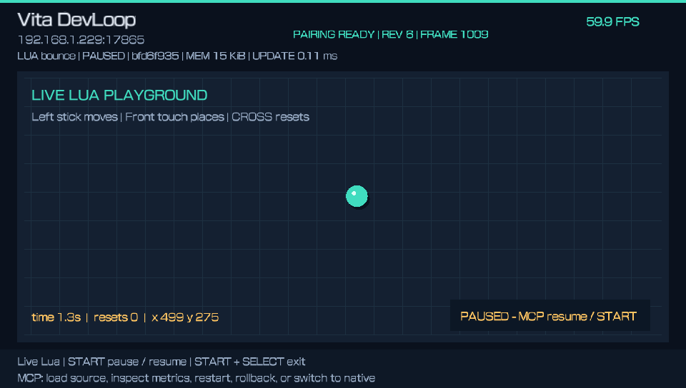
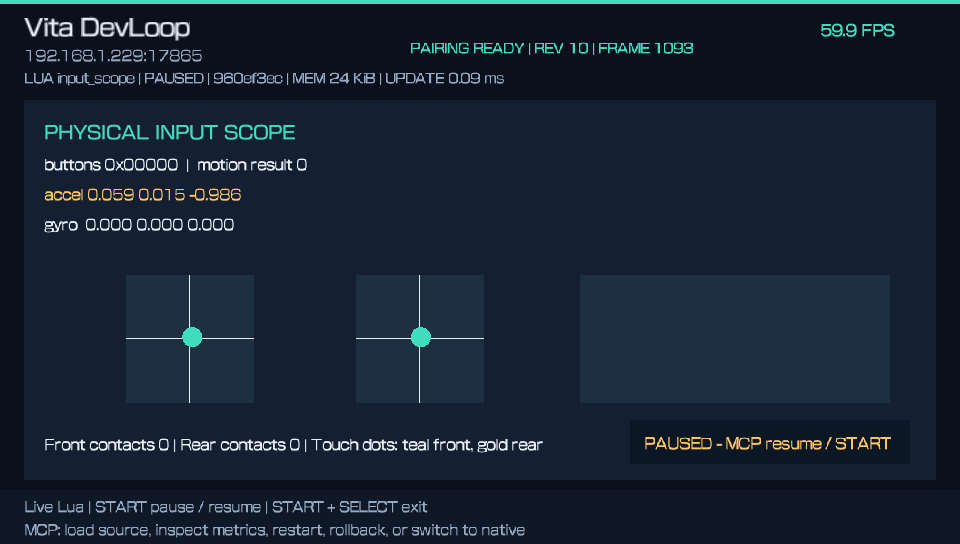
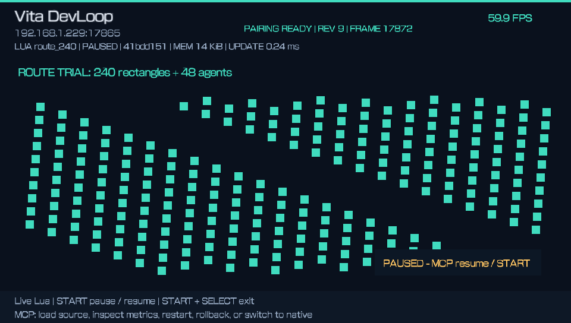

# Real Vita captures

These are original 960×544 framebuffer PNGs captured through MCP from **DevLoop 01.02** on a homebrew-enabled Vita running firmware 3.65 on October 2, 2026. They include the original local network address as approved for publication. They are not mockups or captures of the changed 01.03 candidate.

Each scene is paused for inspection, including captures taken after an experiment ran. The status bar's FPS and callback times are samples, not a benchmark of the Vita's maximum capacity. [Image hashes](screenshots.json) and [prototype validation](prototype-validation.json) bind these captures to their source evidence.

## Lua playground

The ball has advanced during a short run. The starter experiment maps the left stick, front touch and CROSS button to movement, placement and reset.

## Live source edit

The title and ball colour change after loading edited Lua, without rebuilding or reinstalling the native app. The new candidate starts paused after preflight.

## Rollback

Rollback restores the previous VM, including its retained scene state. The earlier ball position and elapsed time remain visible.

## Input scope

The inspector displays button/stick values, touch contacts and motion readings with API status. This still image demonstrates the inspector and its sampled data; physical movement coverage needs separate observations.

## Controlled fault

An intentional later callback error pauses the experiment and leaves MCP inspection available. The real-device proof then recovers through rollback and restores the native paused state.

## Bounded workload trial

A separate trial rendered 240 rectangles with 48 simulated agents. This scene is within DevLoop's 256-command draw limit. Its successful execution is evidence for this specific workload, rather than a general engine performance guarantee.
